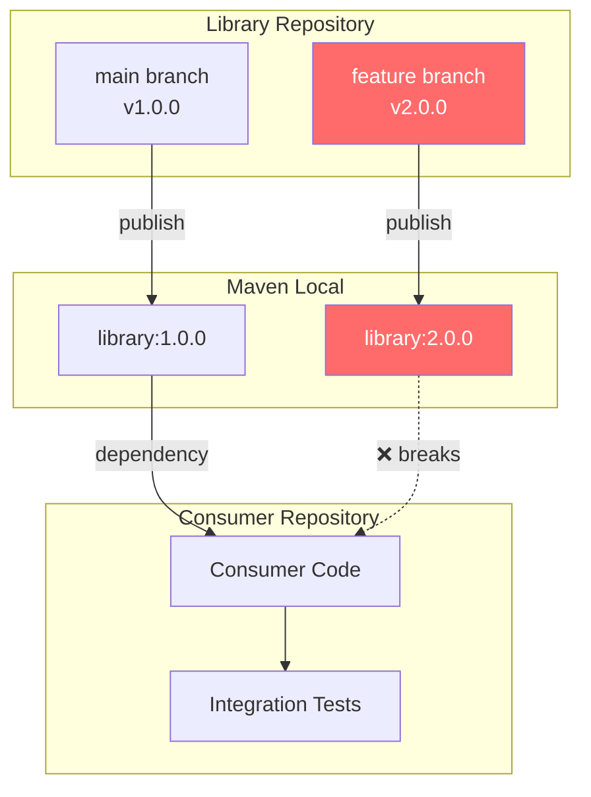
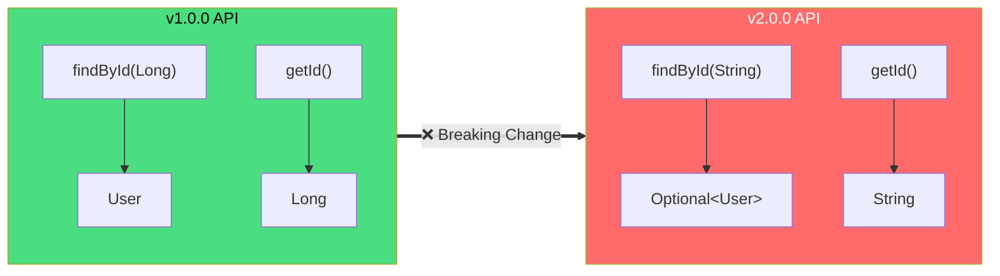
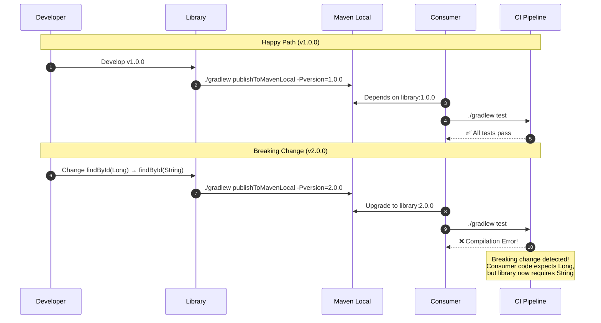
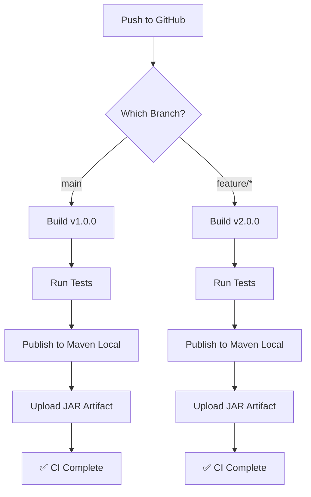

# dep-library

A demonstration library showing how API breaking changes can be detected by consumer tests.

[](https://github.com/pravasna30-dev/dep-library/actions/workflows/ci.yml)

## Overview

This library is part of a demonstration showing how **consumer integration tests act as an early warning system** for breaking API changes. The library has two versions:

| Branch | Version | API Status |
|--------|---------|------------|
| `main` | v1.0.0 | Stable API |
| `feature/method-signature-change` | v2.0.0 | **Breaking Changes** |

## Architecture



## API Versions

### v1.0.0 (main branch) - Stable API

```java
public class UserService {
    public User findById(Long userId);        // Returns null if not found
    public List<User> findAll();
    public User createUser(String email, String name);
}

public class User {
    public Long getId();
    public String getEmail();
    public String getName();
}
```

### v2.0.0 (feature branch) - Breaking Changes

```java
public class UserService {
    public Optional<User> findById(String userId);  // ⚠️ Long→String, User→Optional<User>
    public List<User> findAll();
    public User createUser(String email, String name);
}

public class User {
    public String getId();  // ⚠️ Long→String
    public String getEmail();
    public String getName();
}
```

## Breaking Changes Visualization



## How Breaking Change Detection Works



## Local Development

### Prerequisites

- Java 21+ (JDK, not JRE)
- Gradle 8.5+ (wrapper included)

### Build and Publish

```bash
# Clone the repository
git clone https://github.com/pravasna30-dev/dep-library.git
cd dep-library

# Build the library
./gradlew build

# Publish v1.0.0 to Maven Local
git checkout main
./gradlew publishToMavenLocal -Pversion=1.0.0

# Publish v2.0.0 (breaking changes) to Maven Local
git checkout feature/method-signature-change
./gradlew publishToMavenLocal -Pversion=2.0.0
```

### Verify Published Artifacts

```bash
# Check Maven Local
ls ~/.m2/repository/com/example/library/

# Should show:
# 1.0.0/
# 2.0.0/
```

## CI/CD Pipeline

The GitHub Actions workflow automatically:

1. **Builds** the library on every push
2. **Publishes** to Maven Local for testing
3. **Uploads** JAR artifacts

### Trigger CI Manually

```bash
# Using GitHub CLI
gh workflow run ci.yml --repo pravasna30-dev/dep-library

# Check status
gh run list --repo pravasna30-dev/dep-library
```

### CI Workflow



## Related Repositories

| Repository | Description |
|------------|-------------|
| [dep-consumer](https://github.com/pravasna30-dev/dep-consumer) | Consumer that depends on this library |
| [dep-multimodule](https://github.com/pravasna30-dev/dep-multimodule) | Single repo with both library and consumer |

## License

MIT
